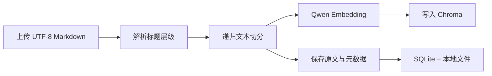
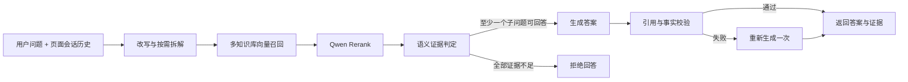
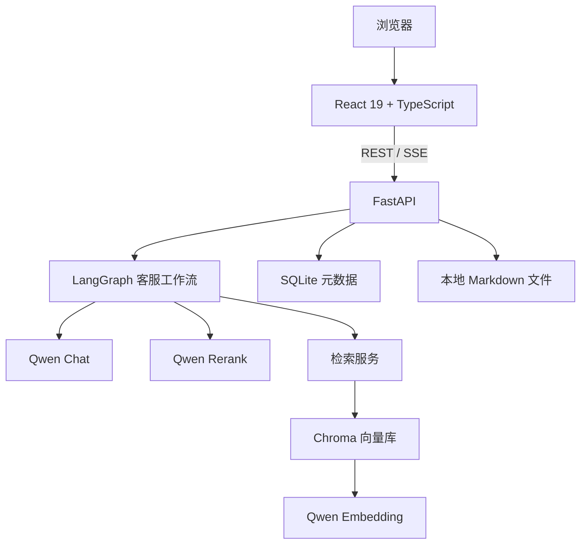

<h1 align="center">RAG 智能客服</h1>

<p align="center"><strong>每一次回答，都有据可循。</strong></p>

<p align="center">
  基于本地知识库的证据约束型 RAG 客服 Demo：先检索、再判定，只有证据充分的内容才会进入回答。
</p>

<p align="center">
  <a href="https://www.python.org/"></a>
  <a href="https://react.dev/"></a>
  <a href="https://fastapi.tiangolo.com/"></a>
  <a href="https://langchain-ai.github.io/langgraph/"></a>
  <a href="https://www.trychroma.com/"></a>
  <a href="https://help.aliyun.com/zh/model-studio/compatibility-of-openai-with-dashscope"></a>
</p>

<p align="center">
  <a href="#overview">项目简介</a> ·
  <a href="#features">核心能力</a> ·
  <a href="#workflow">工作流程</a> ·
  <a href="#architecture">系统架构</a> ·
  <a href="#quick-start">快速开始</a> ·
  <a href="#configuration">配置说明</a>
</p>

---

<a id="overview"></a>

## 项目简介

这是一个面向本地产品资料的 RAG 智能客服原型。它将 Markdown 文档切分并写入向量库，在用户提问时完成问题改写、候选召回、重排、证据判定和答案校验，最终把回答与原始资料对应起来。

这个项目关注的不只是“找到相关内容”，而是进一步判断：**现有资料是否足以直接回答问题**。

```text
相关资料 ≠ 回答证据
检索命中 ≠ 可以作答
模型生成 ≠ 已通过校验
```

> [!NOTE]
> 本项目是个人完成的本地学习 Demo，当前面向个人用户场景，不按生产级 SaaS 系统设计。

<a id="features"></a>

<p align="center">
  
</p>

<p align="center"><sub>项目概览：运行配置与本地知识库状态</sub></p>

<p align="center">
  
</p>

<p align="center"><sub>知识库管理：批量上传 Markdown 并查看文档切块状态</sub></p>

<p align="center">
  
</p>

<p align="center"><sub>证据约束问答：展示执行过程、回答引用与原始证据</sub></p>

## 核心能力

| 能力 | 当前实现 |
| --- | --- |
| 知识库管理 | 创建、查看和删除知识库，可在问答时同时选择多个知识库 |
| 文档入库 | 批量上传 UTF-8 Markdown，按标题层级切分并保留来源路径 |
| 重复拦截 | 根据规范化内容的 SHA-256 摘要，在向量化前拦截重复文档 |
| 问题理解 | 结合当前页面中的会话历史改写问题，并按需拆为最多 5 个子问题 |
| 检索与重排 | Chroma 向量召回候选，使用 `qwen3-rerank` 重新排序并保留 Top-K |
| 证据判定 | 将“相关资料”与“足以直接回答的证据”分开判断 |
| 部分回答 | 复合问题中，有证据的部分正常回答，证据不足的部分单独拒答 |
| 生成后校验 | 检查引用、数字和证据支持关系；失败部分最多重新生成一次 |
| 可追溯展示 | 右侧展示文档名、标题路径、原文片段、向量分数与重排分数 |
| 流式反馈 | 通过 SSE 返回改写、检索、判定、生成和校验阶段的实时状态 |

<a id="workflow"></a>

## RAG 工作流程

### 文档入库



### 用户问答



LangGraph 中的主链路为：

```text
START → rewrite → retrieval → judge → answer / refuse → END
```

<a id="design"></a>

## 核心设计

### 1. 把“相关”与“可回答”分开

向量相似或重排靠前只能说明资料与问题相关，不能证明它包含直接答案。系统会在检索后增加语义证据判定，将候选资料标记为：

- **回答证据**：能够直接支持当前回答；
- **相关资料，不足以直接回答**：主题相关，但缺少必要事实或条件。

### 2. 对复合问题分别负责

问题可以按需拆为最多 5 个可独立回答的子问题。每个子问题分别检索并判断证据，因此系统可以回答有依据的部分，同时明确拒绝没有依据的部分，而不是把整道问题全部回答或全部拒绝。

### 3. 生成不是终点

初次生成后，系统还会检查引用是否合法、数字是否受到证据支持、回答是否越过已判定的证据边界。校验失败的部分会携带失败原因重新生成一次；再次失败则不作为已验证答案输出。

### 4. 保持三类存储职责清晰

| 存储 | 职责 |
| --- | --- |
| 本地文件 | 保存上传的原始 Markdown |
| SQLite | 保存知识库、文档、文件路径、摘要和状态等元数据 |
| Chroma | 保存文本块、Embedding 与来源元数据 |

删除知识库或文档时，会同步处理这三类数据；入库中途失败时会执行补偿清理，避免留下不完整状态。

<a id="architecture"></a>

## 系统架构



| 层级 | 技术 | 职责 |
| --- | --- | --- |
| Web | React 19、TypeScript、Vite | 知识库管理、问答交互与证据展示 |
| API | FastAPI、SSE | 文档接口、知识库接口和流式问答 |
| 工作流 | LangGraph | 编排改写、检索、判定、回答与拒答 |
| 检索 | Chroma、Qwen Embedding、Qwen Rerank | 候选召回与重排 |
| 数据 | SQLite、本地文件 | 元数据和原始文档持久化 |

<a id="quick-start"></a>

## 快速开始

### 环境要求

- Windows 10/11
- Python `3.12`
- Node.js 与 `pnpm`
- 可用的阿里云百炼 API Key，并已开通所配置的模型

### 1. 克隆项目

```powershell
git clone https://github.com/Ruii0504/rag.git
Set-Location rag\rag-customer-service
```

### 2. 安装后端依赖

```powershell
py -3.12 -m venv .venv
.\.venv\Scripts\python.exe -m pip install -r requirements.txt
.\.venv\Scripts\python.exe -m pip install -e .
```

### 3. 安装并构建前端

```powershell
Set-Location frontend
pnpm install
pnpm build
Set-Location ..
```

### 4. 配置环境变量

```powershell
Copy-Item .env.example .env
```

打开 `.env`，至少填写：

```dotenv
QWEN_API_KEY=your-api-key
```

> [!CAUTION]
> API Key 只能保存在已被 Git 忽略的 `.env` 中。不要把密钥写入 `.env.example`、源码、测试、日志或提交记录。

### 5. 启动服务

```powershell
.\.venv\Scripts\python.exe -m uvicorn rag_customer_service.server:create_production_app --factory --host 127.0.0.1 --port 8000
```

浏览器访问 [http://127.0.0.1:8000](http://127.0.0.1:8000)。完成首次构建后，也可以双击 `启动网站.bat` 启动并自动打开页面。

### 首次使用

1. 创建一个知识库；
2. 上传一份或多份 UTF-8 Markdown 文档；
3. 等待文档状态变为“已完成”；
4. 在“智能客服”页面选择检索范围并开始提问；
5. 在右侧核对回答证据和相关资料。

<a id="configuration"></a>

## 配置说明

| 变量 | `.env.example` 中的值 | 说明 |
| --- | --- | --- |
| `QWEN_API_KEY` | 无 | 必填，Chat、Embedding 与 Rerank 共用的 API Key |
| `QWEN_BASE_URL` | `https://dashscope.aliyuncs.com/compatible-mode/v1` | 千问 OpenAI 兼容接口地址 |
| `QWEN_CHAT_MODEL` | `qwen3.7-plus` | 问题处理与回答模型 |
| `QWEN_EMBEDDING_MODEL` | `text-embedding-v4` | Embedding 模型 |
| `QWEN_EMBEDDING_DIMENSION` | `1024` | Embedding 实际返回的向量维度 |
| `QWEN_RERANK_URL` | `https://maas.qianwenaiapi.com/compatible-api/v1/reranks` | `qwen3-rerank` 接口地址 |
| `CHUNK_SIZE` | `800` | 文本块大小 |
| `CHUNK_OVERLAP` | `100` | 相邻文本块重叠长度 |
| `RETRIEVAL_TOP_K` | `7` | 每个子问题在重排后保留的候选数量 |
| `SQLITE_PATH` | `data/app.db` | SQLite 文件路径 |
| `CHROMA_PATH` | `data/chroma` | Chroma 数据目录 |
| `UPLOADS_PATH` | `data/uploads` | 原始文档保存目录 |

> [!WARNING]
> 更换 Embedding 模型或向量维度后，已有向量不能继续复用。请先备份需要保留的数据，再重新构建 Chroma 索引并上传文档。

<a id="structure"></a>

## 项目结构

```text
rag-customer-service/
├── frontend/                         # React 前端
│   └── src/
│       ├── App.tsx                   # 页面与交互流程
│       ├── api.ts                    # REST / SSE 客户端
│       └── index.css                 # 界面样式
├── src/rag_customer_service/
│   ├── agent.py                      # LangGraph 状态与节点编排
│   ├── answering.py                  # 拆解、证据判定、生成与校验
│   ├── retrieval.py                  # 候选召回与结果组装
│   ├── rerank.py                     # Qwen Rerank 客户端
│   ├── ingestion.py                  # Markdown 解析与切分
│   ├── knowledge_base.py             # 知识库和文档生命周期
│   ├── vector_store.py               # Chroma 向量存储
│   ├── storage.py                    # SQLite 与本地文件存储
│   ├── api.py                        # FastAPI 接口
│   └── server.py                     # 生产应用入口
├── .env.example                      # 环境变量示例
├── requirements.txt                  # Python 依赖
└── 启动网站.bat                      # Windows 快速启动脚本
```

<a id="limitations"></a>

## 已知限制与后续计划

### 当前限制

- 仅支持 UTF-8 编码的 Markdown 文档；
- 会话历史只保留在当前浏览器页面中；
- 当前是本地单用户 Demo，没有账号、权限和租户隔离；
- Chat、Embedding 与 Rerank 依赖外部千问接口和当前网络环境；

### 后续计划

- 支持 PDF、Word 等更多文档格式；
- 增加会话持久化与历史会话管理；
- 增加更细粒度的文档预览和引用定位。

<a id="faq"></a>

---

<p align="center">
  这个项目用于学习和展示一条完整、可追溯的 RAG 应用链路。<br />
  重点不是让模型“尽量回答”，而是让每个回答都尊重知识库的证据边界。
</p>
